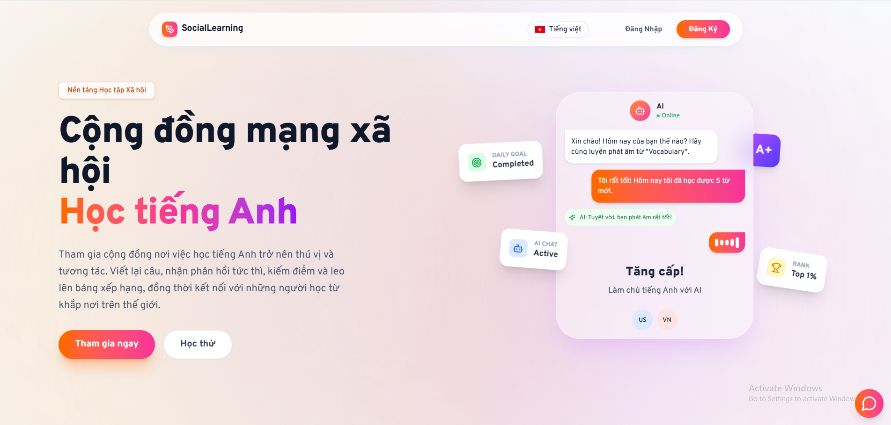

# 🌟 Chào mừng bạn đến với dự án

## 📚 Social Learning

### Nền tảng Mạng xã hội hỗ trợ học tập Tiếng Anh và Giao tiếp Đa phương tiện

[https://www.socialonlinelearning.tech/][1]

---

##### 💬 "Học không chỉ đến từ sách vở, mà còn đến từ cộng đồng, nhóm và xã hội."

---

## 📖 GIỚI THIỆU

**Social Learning** là một hệ sinh thái học tập toàn diện kết hợp giữa mạng xã hội và các công cụ rèn luyện tiếng Anh (Nghe, Nói, Viết). Dự án giải quyết vấn đề thiếu tính tương tác và môi trường giao tiếp thực tế trong các ứng dụng học tập hiện nay bằng cách tích hợp **Trí tuệ nhân tạo (AI)** và **Giao tiếp thời gian thực (Real-time Communication)**.

**Mục tiêu:** Tạo ra một cộng đồng năng động nơi người học không chỉ tiếp thu kiến thức cá nhân hóa mà còn có thể kết nối, chia sẻ và luyện tập trực tiếp với nhau.

---

## ✨ TÍNH NĂNG NỔI BẬT

### 🎓 Học tập thông minh (AI Integration)

- **Luyện Viết (Writing):** AI (Gemini) tự động tạo đề bài, chấm điểm ngữ pháp, từ vựng và gợi ý sửa lỗi chi tiết.
- **Luyện Nói (Speaking):**
  - **Roleplay AI:** Hội thoại theo ngữ cảnh (du lịch, công sở...) với phản hồi tức thì.
  - **Free Talk:** Trò chuyện tự do với AI để tăng phản xạ.
  - **Pronunciation:** Đánh giá phát âm qua Google Cloud Speech-to-Text.
- **Luyện Nghe (Listening):** Bài tập điền từ (Gap-fill) được tạo tự động.
- **Từ vựng (Vocabulary):** Học theo Flashcard và phương pháp Lặp lại ngắt quãng (Spaced Repetition).

### 🌏 Mạng xã hội & Giao tiếp (Social & Real-time)

- **Newsfeed:** Đăng bài (Text, Ảnh, Video), Like, Comment, Share.
- **Kết nối:** Kết bạn, Theo dõi (Follow), Gợi ý bạn bè phù hợp.
- **Chat & Call:** Nhắn tin 1-1, Chat nhóm, Gọi thoại (Voice Call) và Gọi Video (Video Call) chất lượng cao.
- **Gamification:** Bảng xếp hạng (Leaderboard), Chuỗi ngày học (Streak), Hệ thống tiền tệ ảo (Snowflake).

---

## 🛠 CÔNG NGHỆ SỬ DỤNG

Dự án được xây dựng trên kiến trúc **Client-Server** với các công nghệ tiên tiến:

### Frontend

- **Mobile:** React Native, NativeWind (TailwindCSS).
- **Web:** Next.js, ReactJS, TailwindCSS.

### Backend

- **Core:** Node.js, Express.js.
- **AI Service:** Google Gemini API, Google Cloud Speech-to-Text.
- **Real-time:** Socket.IO (Chat/Notification), ZegoCloud SDK (Video/Voice Call), Supabase Realtime.
- **Storage:** Cloudinary (Lưu trữ ảnh/video tin nhắn), Supabase Storage (Lưu trữ ảnh/video).

### Database

- **SQL:** Supabase (PostgreSQL) - Quản lý dữ liệu người dùng, bài học, thông báo, lịch sử hoạt động ....
- **NoSQL:** MongoDB - Quản lý tin nhắn.

### Infrastructure & Deployment

- **Server:** Digital Ocean (Droplets).
- **Payment:** Sepay (Cổng thanh toán QR Code).

---

## 📐 SƠ ĐỒ THIẾT KẾ

### 1. Sơ đồ Use Case

Tổng quan các chức năng của Người dùng và Admin.

  
   
  <i>(Mô hình Use-case tổng quát)</i>

### 2. Sơ đồ Database (ERD)

#### SQL (Supabase) - Quản lý Social & Learning

  
  

#### NoSQL (MongoDB) - Quản lý Chat & Realtime

  

### 3. Kiến trúc Phần mềm

  
  
  
(Sơ đồ triển khai phần mềm)

Mô hình kết nối giữa Client, Server, Database và các dịch vụ bên thứ 3 (AI, Payment, Storage).

  
  
  
(Sơ đồ kiến trúc phần mềm)

---

## 📸 HIỆN THỰC GIAO DIỆN

|             Trang chủ & Newsfeed             |              Giao diện Nhắn tin              |
| :------------------------------------------: | :------------------------------------------: |
|  |  |
|         _Giao diện người dùng chính_         |              _Chat & Gọi Video_              |

|                 Luyện Viết                  |                  Luyện Nghe                   |
| :-----------------------------------------: | :-------------------------------------------: |
|  |  |
|           _AI chấm điểm và gợi ý_           |          _Nghe và điền vào ô trống_           |

|              Luyện Nói Cá Nhân               |                 Luyện Nói (Roleplay)                  |
| :------------------------------------------: | :---------------------------------------------------: |
|  |  |
|            _Luyện nói 10 câu mẫu_            |             _Hội thoại trực tiếp với AI_              |

|              Từ Vựng Cá Nhân              |            Tiến Trình Hoạt Động             |
| :---------------------------------------: | :-----------------------------------------: |
|  |  |
|         _Bộ từ vựng mỗi cá nhân_          |       _Lịch sử hoạt động và thống kê_       |

|             Lộ Trình Học Tập             |                   Admin                   |
| :--------------------------------------: | :---------------------------------------: |
|  |  |
|        _Lộ trình của mỗi cá nhân_        |        _Quản lí tất cả thông tin_         |

---

## 🔗 LIÊN KẾT

- **Website:** [https://www.socialonlinelearning.tech/][1]
- **Mobile App:** [Download APK](...)
- **Demo Video:** [Youtube Link](...)

[1]: https://www.socialonlinelearning.tech/

---

## 🧑‍💻 ĐỘI NGŨ PHÁT TRIỂN

Dự án được thực hiện bởi nhóm sinh viên trường Đại học Công nghiệp TP.HCM (IUH).

### 🤝 Thành Viên

| **Họ và Tên**                            | **Vai Trò Chính** | **Trách Nhiệm Cụ Thể**                                                                               |
| :--------------------------------------- | :---------------- | :--------------------------------------------------------------------------------------------------- |
| **Nguyễn Thanh Thuận**   _(21080071)_ | Fullstack         | Quản lý dự án, thiết kế hệ thống, phát triển Frontend - Backend, tích hợp Gemini AI & Deploy.        |
| **Trương Quốc Bảo**   _(21017351)_    | Fullstack         | Quản lý dự án, thiết kế hệ thống, phát triển Frontend - Backend, tích hợp Gemini AI, thiết kế UI/UX. |

### 👩‍🏫 Giảng Viên Hướng Dẫn

- **ThS. Nguyễn Thị Hoàng Khánh**

---

## 📜 GIẤY PHÉP

Dự án được phát hành dưới **MIT License**. Xem chi tiết trong file `LICENSE`.

## 📬 LIÊN HỆ

Nếu bạn có câu hỏi hoặc góp ý, vui lòng liên hệ qua:

- **Email:** ntthuan.dev@gmail.com
- **GitHub Issues:** [Mở issue tại đây](https://github.com/MrNguyen202/.../issues)

  Được xây dựng với ❤️ và ☕ bởi Team Social Learning

